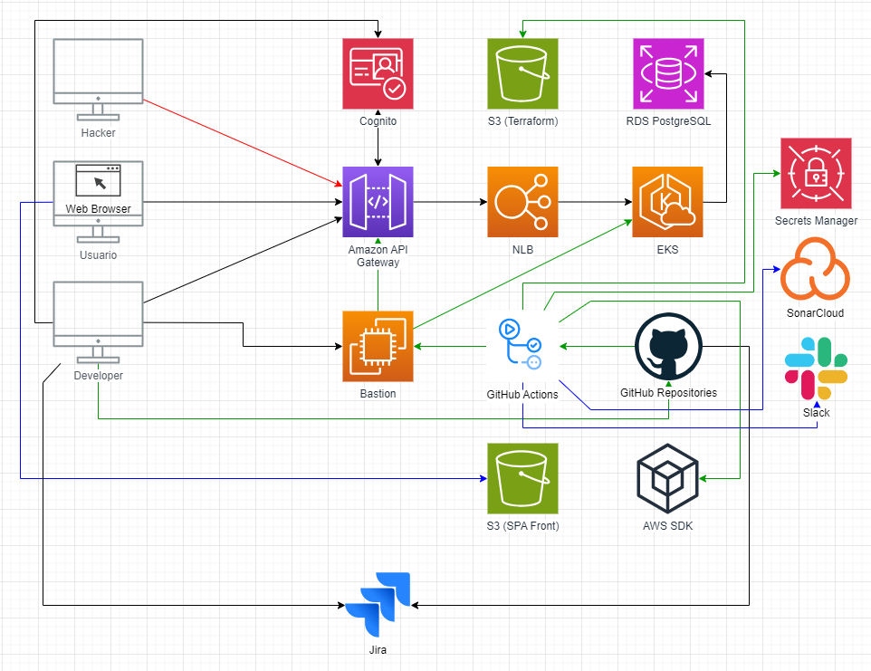

# Infraestructura como Codigo de Arquitectura Cloud (AWS) para Workshop de Indev Solutions

En este repositorio se encuentran las plantillas de Terraform y otros recursos para crear toda la infraestructura necesaria.

## Diagrama de Arquitectura

## Creacion de Recursos 

*Pendiente*

## Eliminacion de Recursos 

*Pendiente*
